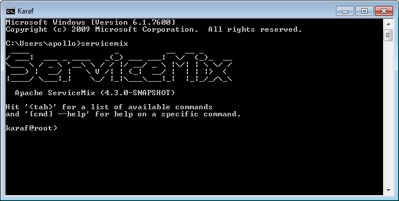

################
Quickstart Guide
################

Introduction
============

First of all, welcome to the Apache ServiceMix project!

The goal of this Quickstart guide is to give you a 20-minute overview of what ServiceMix is and what you can do with
it. In that time, we'll install ServiceMix on your machine, deploy some basic integration routes and extend the
container with an additional feature.

Installing Apache ServiceMix
============================

Before we can start working with Apache ServiceMix, we have to get it installed and running on our local machine first.

System requirements
-------------------

For running Apache ServiceMix itself, you'll need

* Java Runtime Environment (JRE) 1.6.x (Java 6) or
  Java Runtime Environment (JRE) 1.7.x (Java 7)
* About 100 MB of free disk space for the default assembly

If you're developing your own integration applications and OSGi bundles, you'll also need

* Java Developer Kit (JDK) 1.6.x (Java 6) or
  Java Developer Kit (JDK) 1.7.x (Java 7)
* Apache Maven 3.0.4 or higher

Downloading Apache ServiceMix
-----------------------------

Apache ServiceMix |version| is available under the Apache License v2 and can be downloaded from
`the downloads page <http://servicemix.apache.org/downloads.html/>`_.

Depending on your operation system, you should download either the tar.gz or the zip file:

* ``tar.gz`` for Linux/Unix/MacOS X
* ``zip`` for Windows

Installing Apache ServiceMix
----------------------------

Installing Apache ServiceMix is as simple as uncompressing the downloaded archive on your hard disk.  For the rest of
this guide, we'll refer to the this location as *``<SERVICEMIX_HOME>``*.

Starting Apache ServiceMix
--------------------------

Depending on your platform, start Apache ServiceMix by following the instructions below.  After starting the container,
you will have access to the console from which you can manage the container.

On Windows
~~~~~~~~~~

In a command prompt window, navigate to the directory where you extracted ServiceMix and run the ``bin\servicemix.bat``
file.

Example: if ServiceMix in installed in the ``c:\tools\apache-servicemix-|version|`` directory

.. code-block:: bat

   > cd c:\tools\apache-servicemix-|version|
   > .\bin\servicemix

On Linux/Unix/MacOS X
~~~~~~~~~~~~~~~~~~~~~

On a command shell, navigate to the directory where you extracted ServiceMix and the ``bin/servicemix`` shell script

Example: if ServiceMix is installed in the ``~/Applications/apache-servicemix-5.4.0-SNAPSHOT`` directory.

.. code-block:: bash

   $ cd ~/Applications/apache-servicemix-5.4.0-SNAPSHOT
   $ ./bin/servicemix

.. rst-class:: terminal

::

   apache-servicemix-5.4.0-SNAPSHOT user$ bin/servicemix
   Please wait while Apache ServiceMix is starting...
   100% [========================================================================]

    ____                  _          __  __ _
   / ___|  ___ _ ____   _(_) ___ ___|  \/  (_)_  __
   \___ \ / _ \ '__\ \ / / |/ __/ _ \ |\/| | \ \/ /
    ___) |  __/ |   \ V /| | (_|  __/ |  | | |>  <
   |____/ \___|_|    \_/ |_|\___\___|_|  |_|_/_/\_\

     Apache ServiceMix (5.4.0-SNAPSHOT)

   Hit '<tab>' for a list of available commands
   and '[cmd] --help' for help on a specific command.
   Hit '<ctrl-d>' or 'osgi:shutdown' to shutdown ServiceMix.

   karaf@root>

Console Shell
=============

Now that we successfully installed and started Apache ServiceMix, we'll take a closer look at the console. This is
where you manage your ServiceMix instance, add and remove bundles, install optional features, ...

Working with bundles
--------------------

When ServiceMix is first started, a whole set of bundles providing the core features for the product are being
installed. Let's use the command console to find out more about them...

The osgi:list command can be used to get a list of all bundles currently installed. Enter this:

::

   karaf@root> osgi:list

This is what the output looks like if you run this on your ServiceMix instance.

.. rst-class:: terminal

::

    karaf@root> osgi:list
    START LEVEL 100 , List Threshold: 50
       ID   State         Blueprint      Spring    Level  Name
    [  80] [Active     ] [            ] [       ] [   50] geronimo-annotation_1.0_spec (1.1.1)
    [  81] [Active     ] [            ] [       ] [   50] geronimo-jms_1.1_spec (1.1.1)
    [  82] [Active     ] [            ] [       ] [   50] geronimo-j2ee-management_1.1_spec (1.0.1)
    [  83] [Active     ] [            ] [       ] [   50] JAXB2 Basics - Runtime (0.6.4)
    [  84] [Active     ] [            ] [       ] [   50] Apache ServiceMix :: Bundles :: jaxb-impl (2.2.1.1_2)
    [  85] [Active     ] [            ] [       ] [   50] Commons Pool (1.6.0)
    [  86] [Active     ] [            ] [       ] [   50] Commons Net (3.3.0)
    [  87] [Active     ] [            ] [       ] [   50] ZooKeeper Bundle (3.4.5)
    [  88] [Active     ] [            ] [       ] [   50] Apache XBean :: Spring (3.16.0)
    [  89] [Active     ] [Created     ] [       ] [   50] activemq-osgi (5.10.0)
    [  90] [Active     ] [Created     ] [       ] [   50] activemq-karaf (5.10.0)
    [  91] [Active     ] [            ] [       ] [   50] Commons Collections (3.2.1)
    [  92] [Active     ] [            ] [       ] [   50] Commons Lang (2.6)
    [  93] [Active     ] [            ] [       ] [   50] Commons Codec (1.4)
    [  94] [Active     ] [            ] [       ] [   50] Apache ServiceMix :: Bundles :: velocity (1.7.0.6)
    [  95] [Active     ] [            ] [       ] [   50] Apache ServiceMix :: Bundles :: jasypt (1.9.1.1)
    [  96] [Active     ] [            ] [       ] [   50] Apache ServiceMix :: Specs :: Stax API 1.0 (1.9.0)
    [  97] [Active     ] [            ] [       ] [   50] Apache ServiceMix :: Bundles :: xpp3 (1.1.0.4c_5)
    [  98] [Active     ] [            ] [       ] [   50] Joda-Time (1.6.2)
    [  99] [Active     ] [            ] [       ] [   50] Apache ServiceMix :: Bundles :: xstream (1.4.7.1)
    [ 100] [Active     ] [            ] [       ] [   50] Apache Aries Transaction Manager (1.0.0)
    [ 101] [Active     ] [            ] [       ] [   50] geronimo-j2ee-connector_1.5_spec (2.0.0)
    [ 102] [Active     ] [            ] [       ] [   50] Apache Aries Util (1.0.0)
    [ 103] [Active     ] [            ] [       ] [   50] activeio-core (3.1.4)
    [ 104] [Active     ] [            ] [       ] [   50] jettison (1.3.5)
    [ 105] [Active     ] [            ] [       ] [   50] Jackson JSON processor (1.9.12)
    [ 106] [Active     ] [            ] [       ] [   50] Data mapper for Jackson JSON processor (1.9.12)
    [ 107] [Active     ] [            ] [       ] [   50] Scala Standard Library (2.11.0.v20140415-163722-cac6383e66)
    [ 115] [Active     ] [            ] [       ] [   50] camel-core (2.14.1)
    [ 116] [Active     ] [Created     ] [       ] [   50] camel-karaf-commands (2.14.1)
    [ 117] [Active     ] [            ] [       ] [   50] camel-jms (2.14.1)
    [ 123] [Active     ] [            ] [       ] [   50] camel-spring (2.14.1)
    [ 124] [Active     ] [Created     ] [       ] [   50] camel-blueprint (2.14.1)
    [ 125] [Active     ] [            ] [       ] [   50] activemq-camel (5.10.0)
    [ 196] [Active     ] [Created     ] [       ] [   50] camel-cxf-transport (2.14.1)
    [ 197] [Active     ] [Created     ] [       ] [   50] camel-cxf (2.14.1)
    [ 198] [Active     ] [Created     ] [       ] [   50] Apache ServiceMix :: ActiveMQ :: Service (5.4.0.SNAPSHOT)
    [ 199] [Active     ] [Created     ] [       ] [   50] Apache ServiceMix :: ActiveMQ :: Camel (5.4.0.SNAPSHOT)
    karaf@root> _

For every bundle, you see:

* the bundle id
* the bundle state

If the bundle contains a Blueprint or Spring XML file, the next 2 columns will show you if the beans defined there were
created successfully:

* the bundle start level
* the bundle name and version

If you're looking for something specific in the list, you can use unix-like pipes and utilities to help you. An example:
to look for all Camel related bundles...

.. rst-class:: terminal

::

    karaf@root> osgi:list | grep camel
    [ 115] [Active     ] [            ] [       ] [   50] camel-core (2.14.1)
    [ 116] [Active     ] [Created     ] [       ] [   50] camel-karaf-commands (2.14.1)
    [ 117] [Active     ] [            ] [       ] [   50] camel-jms (2.14.1)
    [ 123] [Active     ] [            ] [       ] [   50] camel-spring (2.14.1)
    [ 124] [Active     ] [Created     ] [       ] [   50] camel-blueprint (2.14.1)
    [ 125] [Active     ] [            ] [       ] [   50] activemq-camel (5.10.0)
    [ 196] [Active     ] [Created     ] [       ] [   50] camel-cxf-transport (2.14.1)
    [ 197] [Active     ] [Created     ] [       ] [   50] camel-cxf (2.14.1)
    karaf@root> _

Working with logging
--------------------

Many of the applications you write will have some form of log output. To look at the message in the log file, you can
use the ``log:diplay`` command.

.. rst-class:: terminal

::

    karaf@root> log:display
    2015-01-22 11:29:10,753 | INFO  | FelixStartLevel  | CXFActivator                     | ?                                   ? | 138 - org.apache.cxf.cxf-core - 3.0.2 | Adding the extensions from bundle org.apache.cxf.cxf-rt-ws-addr (186) [org.apache.cxf.ws.addressing.policy.AddressingAssertionBuilder, org.apache.cxf.ws.addressing.policy.UsingAddressingAssertionBuilder, org.apache.cxf.ws.addressing.policy.AddressingPolicyInterceptorProvider, org.apache.cxf.ws.addressing.impl.AddressingWSDLExtensionLoader, org.apache.cxf.ws.addressing.WSAddressingFeature$WSAddressingFeatureApplier, org.apache.cxf.ws.addressing.MAPAggregator$MAPAggregatorLoader]
    2015-01-22 11:29:10,756 | INFO  | FelixStartLevel  | NamespaceHandlerRegisterer       | ?                                   ? | 138 - org.apache.cxf.cxf-core - 3.0.2 | Registered blueprint namespace handler for http://cxf.apache.org/ws/addressing
    2015-01-22 11:29:10,819 | INFO  | FelixStartLevel  | CXFActivator                     | ?                                   ? | 138 - org.apache.cxf.cxf-core - 3.0.2 | Adding the extensions from bundle org.apache.cxf.cxf-rt-ws-mex (191) [org.apache.cxf.ws.mex.MEXServerListener]
    2015-01-22 11:29:10,822 | INFO  | FelixStartLevel  | CXFActivator                     | ?                                   ? | 138 - org.apache.cxf.cxf-core - 3.0.2 | Adding the extensions from bundle org.apache.cxf.cxf-rt-ws-security (188) [org.apache.cxf.ws.security.policy.WSSecurityPolicyLoader, org.apache.cxf.ws.security.cache.CacheCleanupListener]
    2015-01-22 11:29:10,839 | INFO  | FelixStartLevel  | CXFActivator                     | ?                                   ? | 138 - org.apache.cxf.cxf-core - 3.0.2 | Adding the extensions from bundle org.apache.cxf.cxf-rt-ws-rm (190) [org.apache.cxf.ws.rm.RMManager, org.apache.cxf.ws.rm.policy.RMPolicyInterceptorProvider, org.apache.cxf.ws.rm.policy.RM10AssertionBuilder, org.apache.cxf.ws.rm.policy.RM12AssertionBuilder, org.apache.cxf.ws.rm.policy.WSRMP12PolicyLoader, org.apache.cxf.ws.rm.policy.MC11PolicyLoader, org.apache.cxf.ws.rm.policy.RSPPolicyLoader]
    2015-01-22 11:29:10,842 | INFO  | FelixStartLevel  | NamespaceHandlerRegisterer       | ?                                   ? | 138 - org.apache.cxf.cxf-core - 3.0.2 | Registered blueprint namespace handler for http://cxf.apache.org/ws/rm/manager
    2015-01-22 11:29:10,843 | INFO  | FelixStartLevel  | NamespaceHandlerRegisterer       | ?                                   ? | 138 - org.apache.cxf.cxf-core - 3.0.2 | Registered blueprint namespace handler for http://schemas.xmlsoap.org/ws/2005/02/rm/policy
    2015-01-22 11:29:10,852 | INFO  | FelixStartLevel  | CXFActivator                     | ?                                   ? | 138 - org.apache.cxf.cxf-core - 3.0.2 | Adding the extensions from bundle org.apache.cxf.cxf-rt-javascript (192) [org.apache.cxf.javascript.JavascriptServerListener]
    2015-01-22 11:29:10,878 | INFO  | FelixStartLevel  | NamespaceHandlerRegisterer       | ?                                   ? | 138 - org.apache.cxf.cxf-core - 3.0.2 | Registered blueprint namespace handler for http://cxf.apache.org/clustering
    2015-01-22 11:29:11,112 | INFO  | ctivemq.server]) | ActiveMQServiceFactory           | ?                                   ? | 89 - org.apache.activemq.activemq-osgi - 5.10.0 | Starting broker amq-broker
    2015-01-22 11:29:11,130 | INFO  | ctivemq.server]) | ActiveMQServiceFactory$1         | ?                                   ? | 78 - org.apache.servicemix.bundles.spring-context - 3.2.9.RELEASE_1 | Refreshing org.apache.activemq.osgi.ActiveMQServiceFactory$1@7ce08f5f: startup date [Thu Jan 22 11:29:11 CET 2015]; root of context hierarchy
    2015-01-22 11:29:11,194 | INFO  | ctivemq.server]) | XBeanXmlBeanDefinitionReader     | ?                                   ? | 76 - org.apache.servicemix.bundles.spring-beans - 3.2.9.RELEASE_1 | Loading XML bean definitions from file [/Applications/apache-servicemix-5.4.0-SNAPSHOT/etc/activemq.xml]
    2015-01-22 11:29:11,337 | INFO  | FelixStartLevel  | Activator                        | ?                                   ? | 115 - org.apache.camel.camel-core - 2.14.1 | Camel activator starting
    2015-01-22 11:29:11,375 | INFO  | ctivemq.server]) | DefaultListableBeanFactory       | ?                                   ? | 76 - org.apache.servicemix.bundles.spring-beans - 3.2.9.RELEASE_1 | Pre-instantiating singletons in org.springframework.beans.factory.support.DefaultListableBeanFactory@551b8762: defining beans [org.apache.activemq.xbean.XBeanBrokerService#0]; root of factory hierarchy
    2015-01-22 11:29:11,426 | INFO  | FelixStartLevel  | Activator                        | ?                                   ? | 115 - org.apache.camel.camel-core - 2.14.1 | Camel activator started
    2015-01-22 11:29:11,488 | INFO  | ctivemq.server]) | PListStoreImpl                   | ?                                   ? | 89 - org.apache.activemq.activemq-osgi - 5.10.0 | PListStore:[/Applications/apache-servicemix-5.4.0-SNAPSHOT/data/amq-broker/amq-broker/tmp_storage] started
    2015-01-22 11:29:11,512 | INFO  | ctivemq.server]) | BrokerService                    | ?                                   ? | 89 - org.apache.activemq.activemq-osgi - 5.10.0 | Using Persistence Adapter: KahaDBPersistenceAdapter[/Applications/apache-servicemix-5.4.0-SNAPSHOT/data/amq-broker/kahadb]
    2015-01-22 11:29:11,608 | INFO  | FelixStartLevel  | CXFActivator                     | ?                                   ? | 138 - org.apache.cxf.cxf-core - 3.0.2 | Adding the extensions from bundle org.apache.camel.camel-cxf-transport (196) [org.apache.camel.component.cxf.transport.CamelTransportFactory]
    2015-01-22 11:29:11,696 | INFO  | ctivemq.server]) | BrokerService                    | ?                                   ? | 89 - org.apache.activemq.activemq-osgi - 5.10.0 | Apache ActiveMQ 5.10.0 (amq-broker, ID:local-61903-1421922551569-0:1) is starting
    2015-01-22 11:29:11,713 | INFO  | ctivemq.server]) | TransportConnector               | ?                                   ? | 89 - org.apache.activemq.activemq-osgi - 5.10.0 | Connector openwire started
    2015-01-22 11:29:11,713 | INFO  | ctivemq.server]) | BrokerService                    | ?                                   ? | 89 - org.apache.activemq.activemq-osgi - 5.10.0 | Apache ActiveMQ 5.10.0 (amq-broker, ID:local-61903-1421922551569-0:1) started
    2015-01-22 11:29:11,714 | INFO  | ctivemq.server]) | BrokerService                    | ?                                   ? | 89 - org.apache.activemq.activemq-osgi - 5.10.0 | For help or more information please see: http://activemq.apache.org
    2015-01-22 11:29:11,729 | INFO  | FelixStartLevel  | GenericResourceManager           | ?                                   ? | 89 - org.apache.activemq.activemq-osgi - 5.10.0 | Resource manager is unrecoverable
    karaf@root> _

If you're only interested in the latest exception in the log file, you can use ``log:display-exception`` instead.

.. rst-class:: terminal

::

    karaf@root> log:display-exception
    org.apache.karaf.shell.console.MultiException: Error installing bundles:
        Unable to install bundle mvn:a.b.c/test/1.2.3
        at org.apache.karaf.shell.console.MultiException.throwIf(MultiException.java:91)
        at org.apache.karaf.shell.osgi.InstallBundle.doExecute(InstallBundle.java:70)[22:org.apache.karaf.shell.osgi:2.4.0]
        at org.apache.karaf.shell.console.OsgiCommandSupport.execute(OsgiCommandSupport.java:38)[20:org.apache.karaf.shell.console:2.4.0]
        at org.apache.felix.gogo.commands.basic.AbstractCommand.execute(AbstractCommand.java:35)[20:org.apache.karaf.shell.console:2.4.0]
        at org.apache.felix.gogo.runtime.CommandProxy.execute(CommandProxy.java:78)[20:org.apache.karaf.shell.console:2.4.0]
        at org.apache.felix.gogo.runtime.Closure.executeCmd(Closure.java:477)[20:org.apache.karaf.shell.console:2.4.0]
        at org.apache.felix.gogo.runtime.Closure.executeStatement(Closure.java:403)[20:org.apache.karaf.shell.console:2.4.0]
        at org.apache.felix.gogo.runtime.Pipe.run(Pipe.java:108)[20:org.apache.karaf.shell.console:2.4.0]
        at org.apache.felix.gogo.runtime.Closure.execute(Closure.java:183)[20:org.apache.karaf.shell.console:2.4.0]
        at org.apache.felix.gogo.runtime.Closure.execute(Closure.java:120)[20:org.apache.karaf.shell.console:2.4.0]
        at org.apache.felix.gogo.runtime.CommandSessionImpl.execute(CommandSessionImpl.java:92)[20:org.apache.karaf.shell.console:2.4.0]
        at org.apache.karaf.shell.console.jline.Console.run(Console.java:196)[20:org.apache.karaf.shell.console:2.4.0]
        at org.apache.karaf.shell.console.jline.DelayedStarted.run(DelayedStarted.java:79)[20:org.apache.karaf.shell.console:2.4.0]
    Caused by: java.lang.Exception: Unable to install bundle mvn:a.b.c/test/1.2.3
        at org.apache.karaf.shell.osgi.InstallBundle.doExecute(InstallBundle.java:45)[22:org.apache.karaf.shell.osgi:2.4.0]
        ... 11 more
    Caused by: org.osgi.framework.BundleException: Unable to cache bundle: mvn:a.b.c/test/1.2.3
        at org.apache.felix.framework.Felix.installBundle(Felix.java:2878)[org.apache.felix.framework-4.4.1.jar:]
        at org.apache.felix.framework.BundleContextImpl.installBundle(BundleContextImpl.java:165)[org.apache.felix.framework-4.4.1.jar:]
        at org.apache.karaf.shell.osgi.InstallBundle.doExecute(InstallBundle.java:43)[22:org.apache.karaf.shell.osgi:2.4.0]
        ... 11 more
    Caused by: java.io.IOException: Error resolving artifact a.b.c:test:jar:1.2.3: Could not find artifact a.b.c:test:jar:1.2.3 in maven.central.repo (http://repo1.maven.org/maven2/)
        at org.ops4j.pax.url.mvn.internal.AetherBasedResolver.resolve(AetherBasedResolver.java:354)[2:org.ops4j.pax.url.mvn:2.1.0]
        at org.ops4j.pax.url.mvn.internal.AetherBasedResolver.resolveFile(AetherBasedResolver.java:312)[2:org.ops4j.pax.url.mvn:2.1.0]
        at org.ops4j.pax.url.mvn.internal.AetherBasedResolver.resolve(AetherBasedResolver.java:296)[2:org.ops4j.pax.url.mvn:2.1.0]
        at org.ops4j.pax.url.mvn.internal.Connection.getInputStream(Connection.java:131)[2:org.ops4j.pax.url.mvn:2.1.0]
        at org.apache.felix.framework.util.SecureAction.getURLConnectionInputStream(SecureAction.java:524)[org.apache.felix.framework-4.4.1.jar:]
        at org.apache.felix.framework.cache.JarRevision.initialize(JarRevision.java:166)[org.apache.felix.framework-4.4.1.jar:]
        at org.apache.felix.framework.cache.JarRevision.<init>(JarRevision.java:77)[org.apache.felix.framework-4.4.1.jar:]
        at org.apache.felix.framework.cache.BundleArchive.createRevisionFromLocation(BundleArchive.java:878)[org.apache.felix.framework-4.4.1.jar:]
        at org.apache.felix.framework.cache.BundleArchive.reviseInternal(BundleArchive.java:550)[org.apache.felix.framework-4.4.1.jar:]
        at org.apache.felix.framework.cache.BundleArchive.<init>(BundleArchive.java:153)[org.apache.felix.framework-4.4.1.jar:]
        at org.apache.felix.framework.cache.BundleCache.create(BundleCache.java:277)[org.apache.felix.framework-4.4.1.jar:]
        at org.apache.felix.framework.Felix.installBundle(Felix.java:2874)[org.apache.felix.framework-4.4.1.jar:]
        ... 13 more

    karaf@root> _

You can also change the log level at runtime by using the ``log:set`` command. You can try these commands on your
instance now by first setting the log level to ``DEBUG`` and then using grep to make sure that you can actually see
the extra logging.

::

    karaf@root> log:set DEBUG
    karaf@root> log:display | grep DEBUG

.. rst-class:: terminal

::

    2015-01-22 11:59:38,962 | DEBUG | heckpoint Worker | MessageDatabase                  | ?                                   ? | 89 - org.apache.activemq.activemq-osgi - 5.10.0 | Checkpoint done.
    2015-01-22 11:59:41,031 | DEBUG | l Console Thread | LoggingCommandSessionListener    | ?                                   ? | 20 - org.apache.karaf.shell.console - 2.4.0 | Command: 'log:tail' returned 'null'
    2015-01-22 11:59:43,989 | DEBUG | heckpoint Worker | MessageDatabase                  | ?                                   ? | 89 - org.apache.activemq.activemq-osgi - 5.10.0 | Checkpoint started.
    2015-01-22 11:59:43,991 | DEBUG | heckpoint Worker | MessageDatabase                  | ?                                   ? | 89 - org.apache.activemq.activemq-osgi - 5.10.0 | Checkpoint done.
    2015-01-22 11:59:44,643 | DEBUG | l Console Thread | LoggingCommandSessionListener    | ?                                   ? | 20 - org.apache.karaf.shell.console - 2.4.0 | Executing command: 'log:display | grep DEBUG'
    2015-01-22 11:59:44,643 | DEBUG | pe-[log:display] | ServiceRecipe                    | ?                                   ? | 17 - org.apache.aries.blueprint.core - 1.4.1 | Retrieving service for bundle org.apache.karaf.shell.console [20] and service registration org.apache.felix.framework.ServiceRegistrationImpl@12ba47ae
    2015-01-22 11:59:44,643 | DEBUG | pe-[grep, DEBUG] | ServiceRecipe                    | ?                                   ? | 17 - org.apache.aries.blueprint.core - 1.4.1 | Retrieving service for bundle org.apache.karaf.shell.console [20] and service registration org.apache.felix.framework.ServiceRegistrationImpl@217576e1
    2015-01-22 11:59:44,644 | DEBUG | pe-[log:display] | ServiceRecipe                    | ?                                   ? | 17 - org.apache.aries.blueprint.core - 1.4.1 | Method entry: getService, args org.apache.karaf.shell.console.commands.BlueprintCommand@27b2eed2
    2015-01-22 11:59:44,644 | DEBUG | pe-[grep, DEBUG] | ServiceRecipe                    | ?                                   ? | 17 - org.apache.aries.blueprint.core - 1.4.1 | Method entry: getService, args org.apache.karaf.shell.console.commands.BlueprintCommand@7cc6ac8b
    2015-01-22 11:59:44,644 | DEBUG | pe-[log:display] | BlueprintContainerImpl           | ?                                   ? | 17 - org.apache.aries.blueprint.core - 1.4.1 | Instantiating component shell-95
    2015-01-22 11:59:44,644 | DEBUG | pe-[grep, DEBUG] | BlueprintContainerImpl           | ?                                   ? | 17 - org.apache.aries.blueprint.core - 1.4.1 | Instantiating component shell-17
    2015-01-22 11:59:44,645 | DEBUG | pe-[log:display] | BlueprintContainerImpl           | ?                                   ? | 17 - org.apache.aries.blueprint.core - 1.4.1 | Instantiating component blueprintBundleContext
    karaf@root> _

Afterwards, revert the log level to its original ``INFO`` value again with ``log:set``.

::

    karaf@root> log:set INFO

...and there's a lot more
-------------------------

These are obviously just a few examples of what the command shell is all about. There are a lot more commands in the
shell to help you deploy, monitor, manage and troubleshoot the applications you're building with ServiceMix.

Routing with Camel
==================

Now that we know how to operate Apache ServiceMix through the shell console, it's time to start using it for what it is
built for. Let's build our very first integration solution with a Camel route and deploy it on ServiceMix.

Our simple scenario
-------------------

In this simple scenario, we're going to move files from an input directory called camel/input to an output directory
called camel/output. To ensure we can keep track of which files get moved, we'll also write a message to the log file
whenever we move a file.

Creating the route
------------------

One of the most simple ways to deploy a new route on ServiceMix, is by defining the route in a Blueprint XML file.

.. code-block:: xml

    <?xml version="1.0" encoding="UTF-8"?>
    <blueprint
        xmlns="http://www.osgi.org/xmlns/blueprint/v1.0.0"
        xmlns:xsi="http://www.w3.org/2001/XMLSchema-instance"
        xsi:schemaLocation="
          http://www.osgi.org/xmlns/blueprint/v1.0.0
          http://www.osgi.org/xmlns/blueprint/v1.0.0/blueprint.xsd">

        <camelContext xmlns="http://camel.apache.org/schema/blueprint">
          <route>
            <from uri="file:camel/input"/>
            <log message="Moving ${file:name} to the output directory"/>
            <to uri="file:camel/output"/>
          </route>
        </camelContext>

    </blueprint>

Deploying the route
-------------------

In order to deploy and start the route, just copy the XML file you created into ServiceMix' deploy directory. The file
will get picked up and deployed by ServiceMix. You will see a camel/input folder appear in your ServiceMix installation
directory and any files you copy into that directory will get moved into the camel/output directory.

If you do a log:display in the shell, you will also see the log output for every file that's been moved.

.. rst-class:: terminal

::

    karaf@root> log:display
    ...
    2015-01-22 13:07:40,400 | INFO  | le://camel/input | route1                           | ?                                   ? | 115 - org.apache.camel.camel-core - 2.14.1 | Moving test.xml to the output directory

    karaf@root> _

Using the shell to manage the route
-----------------------------------

Using ``osgi:list``, you'll notice that your XML file has been transformed into a bundle and that the Blueprint
container has been created to start your Camel route.

.. rst-class:: terminal

::

    karaf@root> osgi:list
    START LEVEL 100 , List Threshold: 50
       ID   State         Blueprint      Spring    Level  Name
     ...
    [ 212] [Active     ] [Created     ] [       ] [   80] quickstart1.xml (0.0.0)
    karaf@root> _

From this output, you also learn that the bundle id for your XML file is 200. This allow you to start and stop the
route whenever necessary. Let's give this a go now...

First, stop the route with

::

    karaf@root> osgi:stop 212

The route is no longer active, so any files you copy into the orders/input folder will remain there for now. As soon as
you restart the route, the pending files will get moving again.

::

    karaf@root> osgi:start 212

Adding ActiveMQ to the 'Mix
===========================

Out-of-the-box, every Apache ServiceMix instance comes with an embedded ActiveMQ JMS broker. This makes it easy to
communicate between Camel routes using persistent messages on the same machine, but it will also enable you to
distribute your routes over multiple instances afterwards for clustering or load-balancing.

Our scenario
------------

In this scenario, we also want to move files between directories. Instead of logging the move directly, we are going
to send an event JMS message onto a queue. Afterwards, we will create a second Camel route to receive the events and
log them.

Moving files and sending event messages
---------------------------------------

The first Blueprint XML file we'll create contains a Camel route that moves the files from activemq/input to the
activemq/output directory. Afterwards, it will generate an event message and send that to an ActiveMQ queue called
*events*.

.. code-block:: xml

    <?xml version="1.0" encoding="UTF-8"?>
    <blueprint
        xmlns="http://www.osgi.org/xmlns/blueprint/v1.0.0"
        xmlns:xsi="http://www.w3.org/2001/XMLSchema-instance"
        xsi:schemaLocation="
          http://www.osgi.org/xmlns/blueprint/v1.0.0
          http://www.osgi.org/xmlns/blueprint/v1.0.0/blueprint.xsd">

        <camelContext xmlns="http://camel.apache.org/schema/blueprint">
          <route>
            <from uri="file:activemq/input"/>
            <to uri="file:activemq/output"/>

            <setBody>
              <simple>
                FileMovedEvent(file: ${file:name}, timestamp: ${date:now:hh:MM:ss.SSS})
              </simple>
            </setBody>
            <to uri="activemq://events" />
          </route>
        </camelContext>
    </blueprint>

Save this file in ServiceMix' deploy folder and use ``osgi:list`` to check on the bundle status as you did with the
simple Camel example. You should now be able to put files in the *activemq/input* directory and see them being moved
to *activemq/output*.

Receiving the event messages
----------------------------

After deploying the first XML file, you're obviously not seeing any events being logged yet. The event messages are
sent to an ActiveMQ queue, but there's nobody to receive the events yet. Let's change that now by creating a second
Blueprint XML file.

.. code-block:: xml

    <?xml version="1.0" encoding="UTF-8"?>
    <blueprint
        xmlns="http://www.osgi.org/xmlns/blueprint/v1.0.0"
        xmlns:xsi="http://www.w3.org/2001/XMLSchema-instance"
        xsi:schemaLocation="
          http://www.osgi.org/xmlns/blueprint/v1.0.0
          http://www.osgi.org/xmlns/blueprint/v1.0.0/blueprint.xsd">

        <camelContext xmlns="http://camel.apache.org/schema/blueprint">
          <route>
            <from uri="activemq://events"/>
            <to uri="log:events"/>
          </route>
        </camelContext>
    </blueprint>

As soon as this second file has been deployed, you'll start seeing the event messages in your ``log:display`` output.

Using the shell to manage the routes
------------------------------------

You can now start and stop both routes from the command shell. The important thing to note here is that you can stop
the event handler route while files are being processed. As soon as you restart that bundle afterwards, you'll receive
the events from all files that have been moved while the route was not running.

Optional features
=================

Everything discussed in the quickstart guide so far is installed out-of-the-box in Apache ServiceMix, but we also have
a lot of optional features that can be installed in the container when necessary.

List of features
----------------

The list of features is available with the features:list command. The overview shows you whether or not the feature is
currently installed, the version and the name of the feature.

.. rst-class:: terminal

::

    karaf@root> features:list
    State         Version            Name                                    Repository                         Description
    [installed  ] [8.1.15.v20140411] pax-jetty                               org.ops4j.pax.web-3.1.2            Provide Jetty engine support
    [uninstalled] [7.0.27.1        ] pax-tomcat                              org.ops4j.pax.web-3.1.2            Provide Tomcat engine support
    [installed  ] [3.1.2           ] pax-http                                org.ops4j.pax.web-3.1.2            Implementation of the OSGI HTTP Service
    [installed  ] [3.1.2           ] pax-http-whiteboard                     org.ops4j.pax.web-3.1.2            Provide HTTP Whiteboard pattern support
    [installed  ] [3.1.2           ] pax-war                                 org.ops4j.pax.web-3.1.2            Provide support of a full WebContainer
    [installed  ] [2.4.0           ] service-security                        karaf-2.4.0                        Services Security for Karaf
    [installed  ] [2.4.0           ] karaf-framework                         karaf-2.4.0                        Karaf core feature
    [installed  ] [2.4.0           ] aries-proxy                             karaf-2.4.0                        Aries Proxy
    [installed  ] [2.4.0           ] aries-blueprint                         karaf-2.4.0                        Aries Blueprint
    [installed  ] [2.4.0           ] features                                karaf-2.4.0                        Karaf Features support
    [installed  ] [2.4.0           ] admin                                   karaf-2.4.0                        Child instance administration
    [installed  ] [2.4.0           ] diagnostic                              karaf-2.4.0                        Diagnostic support
    [installed  ] [2.4.0           ] shell                                   karaf-2.4.0                        Karaf Shell
    [installed  ] [2.4.0           ] deployer                                karaf-2.4.0                        Karaf Deployer
    [uninstalled] [2.4.0           ] wrapper                                 karaf-2.4.0                        Provide OS integration
    [uninstalled] [2.4.0           ] service-wrapper                         karaf-2.4.0                        Provide OS integration (alias to wrapper feature)
    [uninstalled] [2.4.0           ] obr                                     karaf-2.4.0                        Provide OSGi Bundle Repository (OBR) support
    [installed  ] [2.4.0           ] config                                  karaf-2.4.0                        Provide OSGi ConfigAdmin support
    [installed  ] [8.1.10.v20130312] jetty                                   karaf-2.4.0                        Provide Jetty engine support
    [installed  ] [2.4.0           ] http                                    karaf-2.4.0                        Implementation of the OSGi HTTP service
    ...

The full list contains a lot of different features: optional Camel components, features for adding OBR or wrapper
support to Serviceix, a web console, ... Again, you can use things like ``|`` and grep to find the things in the list that
you're interested in.

::

    karaf@root> features:list | grep camel

Example: Web console
--------------------

To get the web console installed in ServiceMix, install the feature from your console.

::

    karaf@root> features:install webconsole

.. rst-class:: terminal

::

    karaf@root> features:list | grep webconsole
    [uninstalled] [2.4.0           ] webconsole                              karaf-2.4.0                        Karaf WebConsole for administration and monitoring
    karaf@root> _

You will now be able to point your browser to http://localhost:8181/system/console and login with user *smx* and password
*smx* to access the web console. From the webconsole, you can also start and stop bundles, install optional features
again, ...