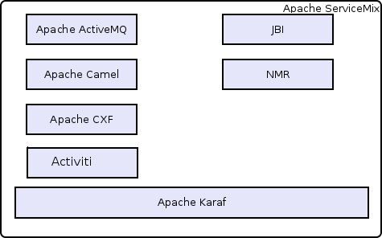

##########
User Guide
##########

Introduction
============

Apache ServiceMix is a flexible, open-source integration container that unifies the features and functionality of
Apache ActiveMQ, Camel, CXF and Karaf into a powerful runtime platform for building integrations solutions.

The goal of this document is to introduce you to the different components that are part of Apache ServiceMix and explain
how and when they can be used together.

What is (in) Apache ServiceMix |version|
========================================

Apache ServiceMix is an open source ESB (Enterprise Service Bus) that combines the functionality of a Service Oriented
Architecture (SOA) and the modularity. The adoption of a Service Bus allows to decouple the applicatons together and
reduce dependencies. Messages are used to wired the applications (=services) and/or connectors to exchange information
using different protocols or communications mode like FTP, HTTP, WebServices, ...

This new version of Apache ServiceMix is more than an evolution of the previous as the kernel of the platform has been
completety rewritten and is designed top of the OSGI specification. Using OSGI framework brings a new important feature
for SOA development : modularity. That means that we can handle classloading and application lifecycle differently
between the components.

ServiceMix is lightweight and easily embeddable, has integrated Spring support and can be run at the edge of the
network (inside a client or server), as a standalone ESB provider or as a service within another ESB. You can use
ServiceMix in Java SE or Java EE application server.

Platform presentation
---------------------

Apache ServiceMix is an distributed ESB built from the ground up on the Java Business Integration (JBI) specification
JSR 208 and released under the Apache license. The goal of JBI is to allow components and services to be integrated in
a vendor independent way, allowing users and vendors to plug and play.

ServiceMix uses ActiveMQ to provide remoting, clustering, reliability and distributed failover.

ServiceMix is completely integrated into Apache Geronimo, which allows you to deploy JBI components and services
directly into Geronimo. ServiceMix is being JBI certified as part of the Geronimo project.

ServiceMix can be embedded into a JEE application server such as JBoss, Oracle Weblogic or IBM Websphere.

ServiceMix includes a complete JBI container supporting all parts of the JBI specification including:

 * NMR (Normalized Message Router)

 * JBI Management MBeans

 * full support for the JBI deployment units with hot-deployment of JBI components

ServiceMix also provides a simple to use client API for working with JBI components and services.

ServiceMix includes many JBI components including HTTP, JMX, CXF, BPEL, etc.

OSGi for Dummies
----------------

`OSGi technology <http://www.osgi.org/About/Technology/>`_ is the dynamic module system for
`Java <http://www.oracle.com/technetwork/java/index.html>`_. The OSGi Service Platform provides functionality to
Java that makes Java the premier environment for software integration and thus for development. Java provides the
portability that is required to support products on many different platforms. The OSGi technology provides the
standardized primitives that allow applications to be constructed from small, reusable and collaborative components.
These components can be composed into an application and deployed.

The OSGi Service Platform provides the functions to change the composition dynamically on the device of a variety of
networks, without requiring restarts. To minimize the coupling, as well as make these couplings managed, the OSGi
technology provides a service-oriented architecture that enables these components to dynamically discover each other
for collaboration. The OSGi Alliance has developed many standard component interfaces for common functions like HTTP
servers, configuration, logging, security, user administration, XML and many more. Plug-compatible implementations of
these components can be obtained from different vendors with different optimizations and costs. However, service
interfaces can also be developed on a proprietary basis.

OSGi technology adopters benefit from improved time-to-market and reduced development costs because OSGi technology
provides for the integration of pre-built and pre-tested component subsystems. The technology also reduces maintenance
costs and enables unique new aftermarket opportunities because components can be dynamically delivered to devices in
the field.

For more information, check out the `OSGi Alliance website <http://www.osgi.org/>`_.

Powered by Apache Karaf
-----------------------

Apache ServiceMix is based on `Apache Karaf <http://karaf.apache.org/>`_. Apache Karaf is a small
`OSGi-based <http://www.osgi.org/Main/HomePage>`_ runtime which provides a lightweight container onto which various
components and applications can be deployed.

Here is a short list of features supported by the Karaf:

Hot deployment
    Karaf supports hot deployment of OSGi bundles by monitoring jar files inside the $home/deploy
    directory. Each time a jar is copied in this folder, it will be installed inside the runtime. You can then update or
    delete it and changes will be handled automatically. In addition, the Karaf also supports exploded bundles and
    custom deployers (blueprint and spring ones are included by default).

Dynamic configuration
    Services are usually configured through the ConfigurationAdmin OSGi service. Such
    configuration can be defined in Karaf using property files inside the $home/etc directory. These configurations are
    monitored and changes on the properties files will be propagated to the services.

Logging System
    Using a centralized logging back end supported by Log4J, Karaf supports a number of different APIs
    (JDK 1.4, JCL, SLF4J, Avalon, Tomcat, OSGi)

Provisioning
    Provisioning of libraries or applications can be done through a number of different ways, by which
    they will be downloaded locally, installed and started.

Native OS integration
    Karaf can be integrated into your own Operating System as a service so that the lifecycle
    will be bound to your Operating System.

Extensible Shell console
    Karaf features a nice text console where you can manage the services, install new
    applications or libraries and manage their state. This shell is easily extensible by deploying new commands dynamically
    along with new features or applications.

Remote access
    use any SSH client to connect to Karaf and issue commands in the console

Security framework
    A security framework based on JAAS

Managing instances
    Karaf provides simple commands for managing multiple instances. You can easily create, delete,
    start and stop instances of Karaf through the console.

For more information, check out the `Apache Karaf project page <http://karaf.apache.org/>`_

JBI Container &Integration with OSGI
------------------------------------

// TODO: write this bit

Normalized Message Router
-------------------------

The Normalized Message Router (NMR) is a general-purpose message bus used for communication between bundles in the OSGi
container.

It's modeled after the Normalized Message Router (NMR) defined in the Java Business Integration (JBI) specification
( http://www.jcp.org/en/jsr/detail?id=208 ).

It can be used to transport XML messages as well as other message body types, optionally augumented with headers and
attachments.

For more information, check out the
`Using the Normalized Message Router User Guide <http://servicemix.apache.org/docs/4.4.x/nmr/index.html>`_

Apache Camel
------------

Apache Camel is a powerful open source integration framework based on known
`Enterprise Integration Patterns <http://camel.apache.org/enterprise-integration-patterns.html>`_ with powerful
`Bean Integration <http://camel.apache.org/bean-integration.html>`_.

Apache Camel lets you create the
`Enterprise Integration Patterns <http://camel.apache.org/enterprise-integration-patterns.html>`_ to implement routing
and mediation rules in either a Java based `Domain Specific Language (or Fluent API) <http://camel.apache.org/dsl.html>`_
, via `Spring based Xml Configuration files <http://camel.apache.org/spring.html>`_ or via the
`Scala DSL <http://camel.apache.org/scala-dsl.html>`_

For more information, check out the
`Using Apache Camel in ServiceMix User Guide <http://servicemix.apache.org/docs/4.4.x/camel/index.html>`_.

Services proposed
-----------------

// TODO: write this bit

Message Broker : Apache ActiveMQ
--------------------------------

Apache ServiceMix ships with an embedded instance of `Apache ActiveMQ <http://activemq.apache.org/>`_ out-of-the-box.

It is a fully functional Apache ActiveMQ message broker instance listening for
`TCP <http://activemq.apache.org/openwire.html>`_ connections on port 61616 and STOMP connections on port 61613.

The `default configuration for the Apache ActiveMQ <http://activemq.apache.org/xml-configuration.html>`_ message broker
resides in the ServiceMix installation directory under the etc sub-directory. The ActiveMQ configuration file is named
*activemq-broker.xml*. It's configured with reasonable default information like
`Persistence (KahaDB) <http://activemq.apache.org/persistence.html>`_ and
`Producer Flow Control <http://activemq.apache.org/producer-flow-control.html>`_ (essentially to make sure the broker
does not run out of memory).

The configuration file also makes use of a reusable connection pool available to all OSGi bundles exposing a
`javax.jms.ConnectionFactory <http://docs.oracle.com/javaee/1.4/api/javax/jms/ConnectionFactory.html>`_ as a service for
consumption. You can re-use this connection pool via tools such as
`spring-dm or blueprint <http://activemq.apache.org/osgi-integration.html>`_.

The ActiveMQ message broker allows several components such as servicemix-cluster,
`camel-jms <http://camel.apache.org/jms.html>`_, `camel-activemq <http://camel.apache.org/activemq.html>`_,
`cxf-jms transport <http://cxf.apache.org/docs/jms-transport.html>`_ to be utilized without any additional configuration.

Transaction : Geronimo Transaction Manager
------------------------------------------

// TODO: write this bit

Routing and Mediation : Apache Camel
------------------------------------

// TODO: write this bit

Web Services : Apache CXF
-------------------------

// TODO: write this bit

Web Container
-------------

// TODO: write this bit

SOA platform
------------

// TODO: write this bit

Spring DM container
~~~~~~~~~~~~~~~~~~~

// TODO: write this bit

Blueprint OSGI container
~~~~~~~~~~~~~~~~~~~~~~~~

// TODO: write this bit

EJB Container
~~~~~~~~~~~~~

// TODO: write this bit

Technology selection guidelines
===============================

ServiceMix 4 offers a set of different messaging and integration technologies:

 * ActiveMQ
 * Camel
 * CXF
 * JBI
 * NMR

Depending on the solution you're building, you want to select one or more of these technologies. Below are some
guidelines to help you pick the right mix for your problem.

When to use Camel?
------------------

For any integration scenario, we recommend to start as simple as possible. Camel allows you to build routes for
integration scenario's quickly and efficiently. You can deploy these routes directly on ServiceMix by deploying the
plain Spring XML route or by packaging the route in an OSGi bundle.

As you need more (advanced) features, start combining Camel with ActiveMQ, CXF and/or the NMR

When to use ActiveMQ?
---------------------

ActiveMQ is a JMS message broker, featuring support for clustering, pluggable persistence mechanism, master-slave
configuration for failover, ...

ServiceMix 4 includes an instance of the ActiveMQ broker, which can be combined with Camel to provide easy-to-use
message persistence and reliable messaging.

After setting up multiple instances of ActiveMQ (or ServiceMix 4) on the network, you can configure ActiveMQ
clustering or master-slave mode to allow for a more reliable and scalable set-up.

When to use CXF?
----------------

CXF is an open-source services framework that you can use to suit your WS-* standards integration needs. It allows you
to use common programming APIs like JAX-RS or JAX-WS for building your own services and to expose them to the outside
world.

You can use CXF from within your Camel routes with the Camel CXF component.

When to use NMR?
----------------

The NMR provides the basic ESB features for ServiceMix 4. You can use it to connect multiple camel routes in a
lightweight way. It can also be used as a common transport on which you can add container-level auditing by registering
your own ExchangeListener implementation.

When to use JBI?
----------------

We still support JBI 1.0 in ServiceMix 4 so you can leverage your previous investments and move your existing JBI
artifacts from ServiceMix 3 to the new container with no/minimal changes before migrating them to use Camel and/or CXF
directly. For new projects, you should consider JBI deprecated and always use Camel and/or CXF inside ServiceMix
instead.

